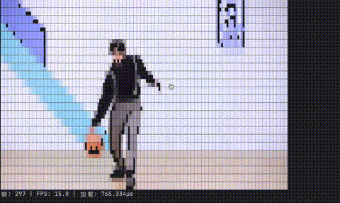

# Terminal Video Player

🎬 A high-performance terminal video player that converts videos into ultra-high resolution colored ASCII art using advanced quadrant block rendering techniques.

**English** | [中文](README_zh.md)

## ✨ Features

- **Ultra-High Resolution ASCII Art**: Uses 2x2 pixel sampling with 16 Unicode quadrant block characters for maximum detail
- **True Color Support**: 24-bit ANSI color rendering for vibrant video display
- **Optimized Performance**: Pre-allocated buffers, atomic output, and precise timing control for smooth playback
- **Modular Architecture**: Clean internal package structure following Go best practices
- **Cross-Platform**: Works on macOS, Linux, and Windows with ffmpeg support
- **Customizable Output**: Adjustable terminal dimensions and frame rate
- **Real-time Processing**: Live frame extraction and conversion with minimal latency

## 🎥 Demo

### Original Video vs Terminal Output Comparison

| Original Video | Terminal ASCII Art Output |
|----------------|---------------------------|
|  |  |

*Left: Original video input | Right: High-resolution colored ASCII art output in terminal*

## 🚀 Quick Start

### Prerequisites

- **Go 1.24+** - [Download Go](https://golang.org/dl/)
- **ffmpeg** - Required for video frame extraction

#### Install ffmpeg:
```bash
# macOS
brew install ffmpeg

# Ubuntu/Debian
sudo apt install ffmpeg

# Centos
sudo yum install ffmpeg

# Windows
# Download from https://ffmpeg.org/download.html and add to PATH
```

### Installation

```bash
# Clone the repository
git clone https://github.com/songhaozhan/terminal-video-player.git
cd terminal-video-player

# Build the player
go build -o video_player main.go
```

### Usage

```bash
# Basic usage
go run main.go video/sample.mp4

# Custom dimensions and frame rate
go run main.go video/sample.mp4 120 30 24

# Or use the built binary
./video_player video/sample.mp4
```

## 📋 Command Line Options

```
go run main.go <video_file> [width] [height] [fps]
```

| Parameter | Description | Default |
|-----------|-------------|---------|
| `video_file` | Path to video file (required) | - |
| `width` | Terminal width in characters | 80 |
| `height` | Terminal height in characters | 24 |
| `fps` | Playback frame rate | 15.0 |

### Examples

```bash
# Play video with default settings
go run main.go video/sample.mp4

# Custom resolution for larger terminals
go run main.go video/sample.mp4 160 40

# High frame rate playback
go run main.go video/sample.mp4 100 30 30

# Widescreen format
go run main.go video/sample.mp4 200 25 20
```

## 🏗️ Architecture

The project follows a modular internal package structure:

```
├── internal/
│   └── modules/
│       ├── converter/     # ASCII art conversion algorithms
│       ├── frames/        # Video frame extraction and loading
│       ├── player/        # Core playback engine
│       └── terminal/      # Terminal control functions
├── video/                 # Sample video assets
├── main.go               # Application entry point
└── go.mod               # Go module definition
```

### Core Components

- **Frame Extraction**: Uses ffmpeg to extract video frames as PNG images
- **ASCII Conversion**: Advanced quadrant block character mapping with luminance calculation
- **Playback Engine**: Optimized rendering with frame timing and terminal control
- **Terminal Control**: ANSI escape sequences for smooth display

## 🎨 Technical Details

### Quadrant Block Rendering

The ASCII conversion uses a sophisticated 2x2 pixel sampling technique with 16 Unicode quadrant block characters:

```
▘ ▝ ▀ ▖ ▌ ▞ ▛ ▗ ▚ ▐ ▜ ▄ ▙ ▟ █
```

Each character represents a specific pattern of bright/dark quadrants, enabling 4x higher resolution than traditional ASCII art.

### Color Processing

- **Luminance Calculation**: Uses ITU-R BT.601 formula (0.299R + 0.587G + 0.114B)
- **Adaptive Thresholding**: Dynamic brightness threshold for optimal contrast
- **True Color Output**: 24-bit RGB ANSI escape sequences for accurate color reproduction

### Performance Optimizations

- **Pre-allocated Buffers**: Minimizes memory allocations during playback
- **Atomic Output**: Single-write rendering to reduce terminal flicker
- **Precise Timing**: Frame-accurate playback with timing compensation
- **Efficient Scaling**: FFmpeg-based frame preprocessing

## 🛠️ Development

### Building from Source

```bash
# Clone and build
git clone https://github.com/songhaozhan/terminal-video-player.git
cd terminal-video-player
go mod tidy
go build -o video_player main.go
```

### Running Tests

```bash
go test ./...
```

### Code Formatting

```bash
go fmt ./...
```

## 📺 Supported Formats

Thanks to ffmpeg integration, the player supports a wide range of video formats:

- **MP4** (H.264, H.265)
- **AVI**
- **MOV**
- **MKV**
- **WebM**
- **FLV**
- And many more...

## ⚡ Performance Tips

1. **Terminal Size**: Larger dimensions require more processing power
2. **Frame Rate**: Higher FPS increases CPU usage
3. **Video Resolution**: Consider downscaling very high resolution videos
4. **Terminal**: Use hardware-accelerated terminals for best performance
5. **SSD Storage**: Faster storage improves frame loading times

## 🤝 Contributing

Contributions are welcome! Please feel free to submit a Pull Request. For major changes, please open an issue first to discuss what you would like to change.

### Development Setup

1. Fork the repository
2. Create your feature branch (`git checkout -b feature/amazing-feature`)
3. Commit your changes (`git commit -m 'Add some amazing feature'`)
4. Push to the branch (`git push origin feature/amazing-feature`)
5. Open a Pull Request

## 📄 License

This project is licensed under the MIT License - see the [LICENSE](LICENSE) file for details.

## 🙏 Acknowledgments

- [ffmpeg](https://ffmpeg.org/) - Powerful multimedia framework
- Unicode Consortium for quadrant block characters
- Go community for excellent tooling and libraries

## 📞 Support

If you encounter any issues or have questions:

1. Check the [Issues](https://github.com/songhz/ai_tool2/issues) page
2. Create a new issue with detailed information
3. Include your OS, Go version, and ffmpeg version

---

**Made with ❤️ and Go**